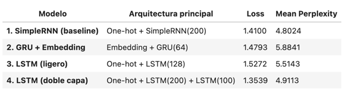
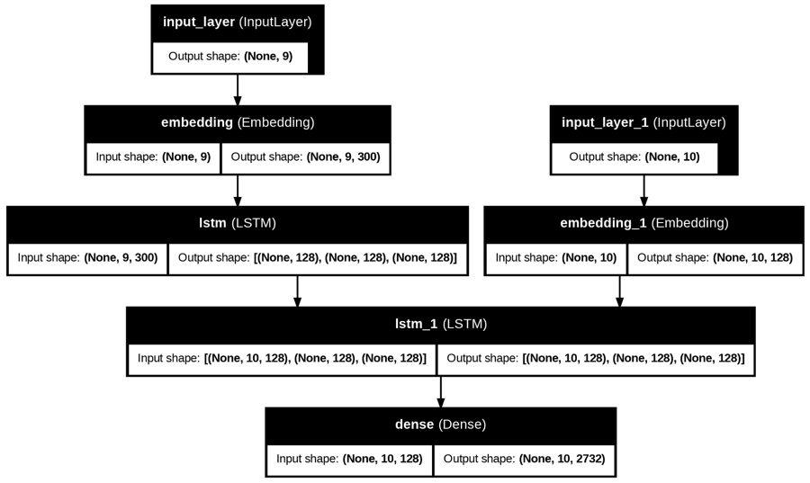

# Procesamiento del Lenguaje Natural - Challenges - CEIA - FIUBA

**Alumno:** Claudio Guillermo Barril

---

## Desafío 1: Vectorización y Similitud de Documentos

### 🔹 Fase 1: Representación y Similitud de Documentos

Se aplican métodos de vectorización como **Bag of Words** y **TF-IDF** para transformar los textos en vectores numéricos.\
Se calcula la **distancia del coseno** entre documentos para identificar pares similares.\
Esta representación permite comparar el contenido textual de forma cuantitativa.

**Observaciones:**
> El resultado fue variado, entre documentos que resultan similares por contenido temático y de clase, y otros en los que se aprecia ruido o en los que ciertas características de los mismos complicaron la tarea (como extensas firmas en emails de reducido tamaño).

### 🔹 Fase 2: Entrenamiento de Modelo de Clasificación

Se entrena un modelo de clasificación **Naive Bayes** basado en las representaciones generadas.\
Finalmente, el modelo elegido tras una búsqueda de hiperparámetros, resulta ser **Complement Naive Bayes**, una variante optimizada para datos desbalanceados.

**🔎 Modelo seleccionado:**
- `clf`: `ComplementNB()` → Elegido por su robustez ante clases desbalanceadas.

**⚙️ Parámetros del clasificador (`clf`):**
- `clf__alpha`: `0.6374` → Regularización moderada que mejora la generalización.
- `clf__fit_prior`: `False` → No ajusta automáticamente las probabilidades previas.

**📝 Parámetros del vectorizador TF-IDF (`tfidf`):**
- `tfidf__max_features`: `None` → Se usan todas las palabras disponibles.
- `tfidf__ngram_range`: `(1, 2)` → Usa unigramas y bigramas.
- `tfidf__norm`: `'l2'` → Normalización L2 aplicada.
- `tfidf__stop_words`: `'english'` → Elimina palabras comunes del inglés.
- `tfidf__sublinear_tf`: `True` → Aplica escala logarítmica a la frecuencia de términos.
- `tfidf__use_idf`: `True` → Usa la frecuencia inversa de documentos.

### 🔹 Fase 3: Vectorización de Matriz Transpuesta (Similitud de Palabras)

Se invierte la matriz documento-término para analizar similitudes entre palabras (en lugar de documentos).\
Esto permite identificar qué términos tienden a aparecer en contextos similares.

**Observaciones:**
> El modelo logra buenas asociaciones en algunos casos, pero también introduce bastante ruido y errores tipográficos.

Colab: [document_similarity_vectorization](https://colab.research.google.com/github/claudiobarril/pln1_17co2024/blob/main/Desafio_1.ipynb)

---

## Desafío 2: Embeddings Personalizados

Se entrenan embeddings de palabras utilizando como corpus los cuentos de *"Las mil y una noches"*.\
Se prueban dos enfoques de segmentación del texto: por **páginas** y por **líneas**.

**Comparación de modelos:**
- Ambos enfoques generan listas de términos similares con pequeñas variaciones.
- El modelo por páginas tiende a producir resultados más **literarios y contextuales**, mientras que el de líneas ofrece términos más **variados y específicos**.

**Conclusiones del test de analogías:**
- El modelo basado en páginas muestra mayor coherencia semántica en las analogías.
- El modelo por líneas genera algunas respuestas acertadas, pero también otras inesperadas.
- Esto evidencia que la **segmentación del corpus influye significativamente** en las relaciones semánticas que el modelo captura.

Colab: [custom_embeddings](https://colab.research.google.com/github/claudiobarril/pln1_17co2024/blob/main/Desafio_2.ipynb)

---

## Desafío 3: Modelo Predictivo de Caracteres

Se construyen modelos RNN para predecir secuencias de caracteres a partir de un corpus bíblico.\

**Comparación de métricas:**\

**Resumen de resultados:**
- **Modelo 1 (SimpleRNN)**: Mejor perplexity media (entre 4 y 6), demuestra ser competitivo pese a su arquitectura básica.
- **Modelo 2 (GRU + Embedding)**: Peor desempeño. El tamaño reducido del vocabulario (62) no se benefició de embeddings, y la capacidad de la GRU resultó limitada.
- **Modelo 3 (LSTM ligero)**: Rendimiento ligeramente mejor que el modelo GRU, pero inferior a los modelos 1 y 4.
- **Modelo 4 (LSTM con dos capas)**: Mejor resultado en términos de pérdida, indica buen ajuste al entrenamiento.

Colab: [char_prediction_rnn](https://colab.research.google.com/github/claudiobarril/pln1_17co2024/blob/main/Desafio_3.ipynb)

---

## Desafío 4: Chatbot QA con LSTM

Se implementa un chatbot de preguntas y respuestas basado en redes LSTM.

**Arquitectura utilizada:**\

**Evaluación:**
- Las respuestas generadas no fueron satisfactorias. Se observaron repeticiones y falta de coherencia con las preguntas.
- Se evaluó con las preguntas propuestas por la cátedra y otras distintas, sin obtener buenos resultados.

**Pruebas adicionales realizadas (no incluidas en la notebook):**
- Early stopping y model checkpoint instanciados.
- Entrenamiento extendido con mayor longitud de entrada.
- Modificaciones menores al modelo.

**Decisión final:**
- Se mantuvo solamente la versión final que representa mejor lo realizado, reduciendo el ruido de intentos fallidos.
- Se considera que hay espacio para nuevas pruebas y mejoras, por lo que quedo abierto a sugerencias.

Colab: [lstm_chatbot_qa](https://colab.research.google.com/github/claudiobarril/pln1_17co2024/blob/main/Desafio_4.ipynb)

---

## Contacto
📧 claudiobarril@gmail.com

---

## ¡Gracias!
